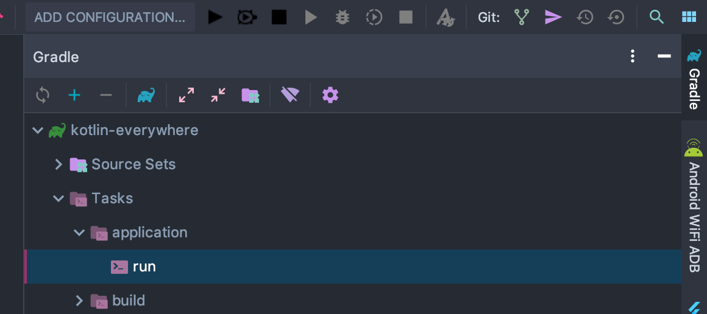
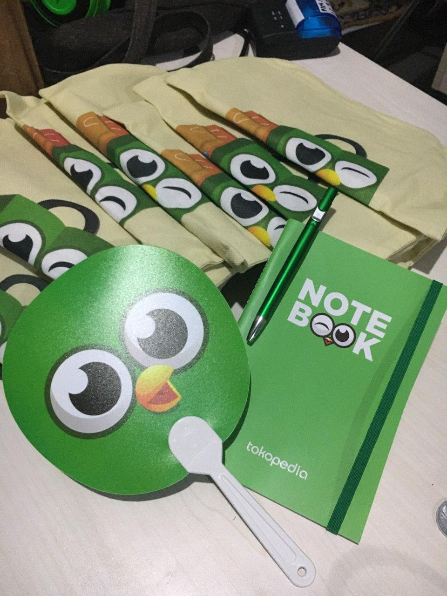
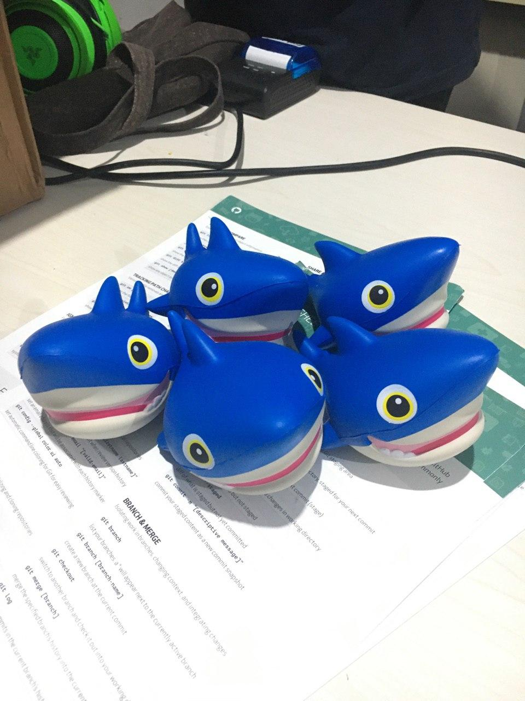
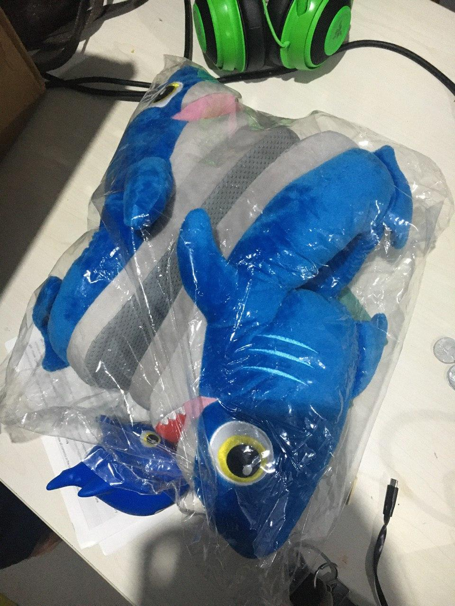
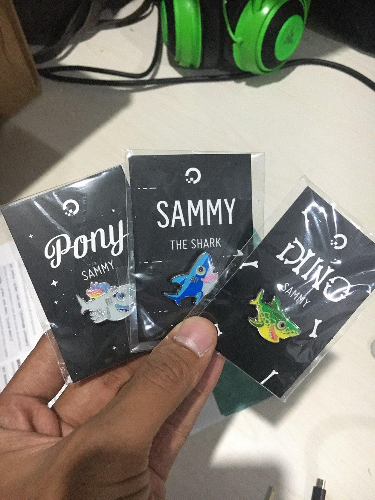
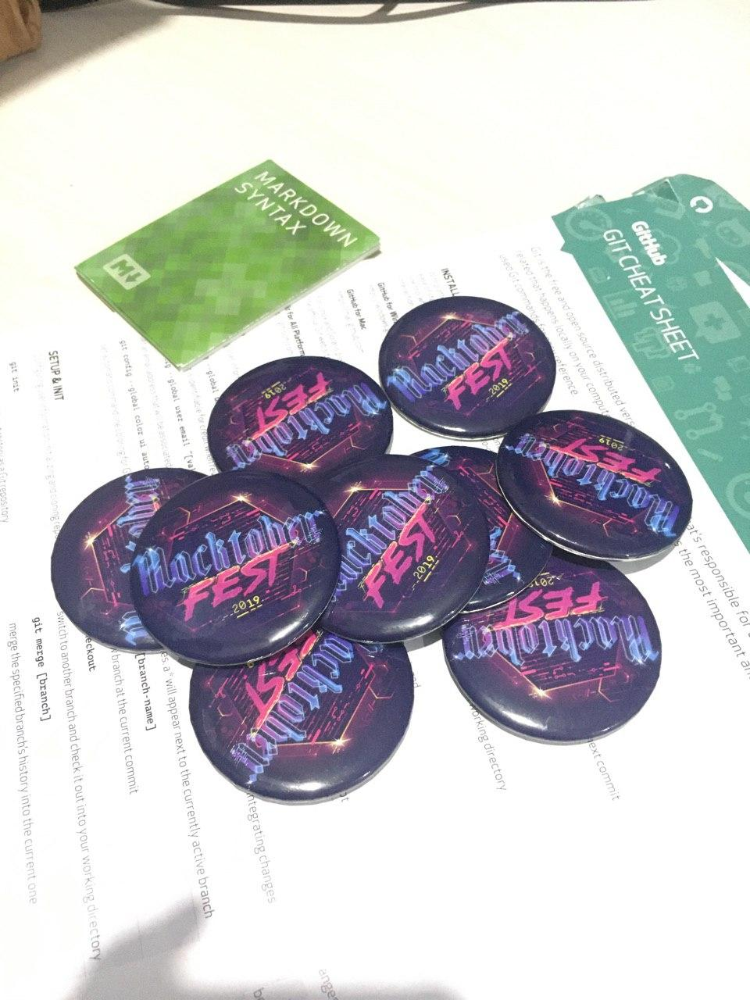
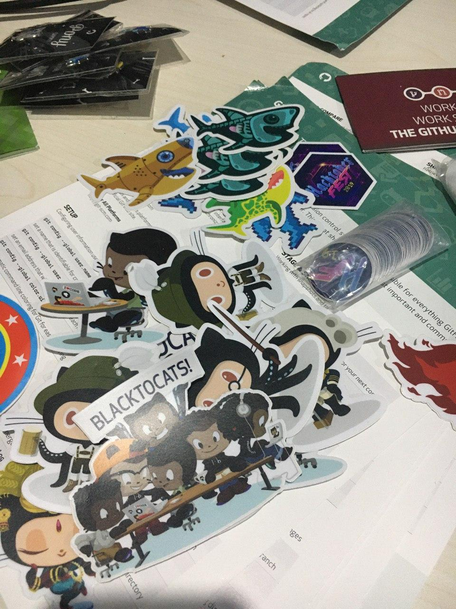

# KOTLIN/Everywhere & Hacktoberfest Mataram
## WEB Challenge 

Dalam repository ini anda di challenge untuk membuat sebuah website dengan menggunakan Kotlin. Framework yang digunakan pada repository ini yakni: [ktor](http://ktor.io/).

### Cara Berkontribusi:
Sebelum memulai, silahkan beri Bintang.

1. Fork Project
2. Clone ke lokal komputer anda
3. Buka project dengan IntelliJ IDEA
4. Buka direktory `src/contributors`
5. Tambahkan class baru (WAJIB KOTLIN), format penamaan: `NamaAnda`, atau `NamaAnda123`, dst.
6. Implement `Contributor` interface di class tersebut.
7. Isi kontent. Lihat contoh pada file `HayiNukman.kt` jangan lupa buat companion object `initialize` untuk memidahkan linking class dengan helper.

```kotlin
    companion object {
        fun initialize(map: MutableMap<String, Contributor>) {
            map["ha-yi"] = HayiNukman()
            map["hayinukman"] = HayiNukman()
            map["hayi"] = HayiNukman()
        }
    }
``` 
CATATAN: 

- saat mapping, gunakan unique id, bisa id github anda, atau email address.
- jangan ganti ID orang lain yang sudah ada. first come first serve. Bagi yang mengoverride nama orang lain, maka tidak akan di merge (PR ditolak).


8. Setelah class dibuat, buka file `ContributorHelper.kt`
9. Tambahkan inisialisasi class contributor anda ke sini dalam blok ini di class ContributorHelper. Contohnya:
```kotlin
    init {
        contributors.apply {
            HayiNukman.initialize(this)
            Abdullah.initialize(this)
            RobiHuzwandar.initialize(this)
        }
    }
```
10. Test.
11. Commit perubahan, kemudian lakukan pull request. 

### Cara menjalankan
1. Linux / Mac
    * Buka terminal dan masuk ke path projek ini
    * Jalankan perintah `./gradlew run`
    * Akses `http://localhost:8080` di browser mu
    * Untuk lebih mudah, jalankan printah `./gradlew -t build` di terminal yang lain untuk mengaktifkan `autobuild` dan selamatkan waktumu
2. Windows
    * Buka CMD dan masuk ke directory project ini.
    * jalankan perintah `gradlew.bat run` dari dalam folder project
    * akses `http://localhost:8080` melalui web browser

3. IntelliJ IDEA
    * Buka Tab gradle yang ada pada panel sebelah kanan
    * kemudian Pilih `Tasks` > `application` > `run`
    
    
===========================================

# KOTLIN/Everywhere & Hacktoberfest Mataram
## WEB Challenge 

In this Repository you are challenged to make a Website using Kotlin. Framework used in this repository is [ktor](http://ktor.io/).

### How to Contribute :
Before start contributing, please give star to this repo.

1. Fork the Project
2. Clone or Download to your local storage
3. Open the project using IntelliJ IDEA
4. Open directory `src/contributors`
5. Added new class (MUST BE KOTLIN), format name : `YourName`, or `Name123` etc.
6. Implement `Contributor` interface in your class.
7. Content value. see an example on file `HayiNukman.kt` , dont forget to create companion object `initialize` to move linking class with helper.

```kotlin
    companion object {
        fun initialize(map: MutableMap<String, Contributor>) {
            map["ha-yi"] = HayiNukman()
            map["hayinukman"] = HayiNukman()
            map["hayi"] = HayiNukman()
        }
    }
``` 
#### Noted : 
- when mapping, use unique id, you can use your github id or your email address.
- don't change other people's IDs that already exist. first come first serve. for those who override the name another person, it will not be merged(Pull Request Rejected)

8. after the class created, open file `ContributorHelper.kt`
9. add your Inisialitation class contribution into the block of the class ContributorHelper. e.g. :

```kotlin
    init {
        contributors.apply {
            HayiNukman.initialize(this)
            Abdullah.initialize(this)
            RobiHuzwandar.initialize(this)
        }
    }
```

10. Testing
11. Commit your changes, then do pull request 

### How to run
1. Linux / Mac
    * Open your terminal and enter into this project path
    * run command `./gradlew run`
    * Access `http://localhost:8080` on your browser
    * For better, run `./gradlew -t build` command in another terminal to activate `autobuild` and save your time
2. Windows
    * open CMD and navigate to root directory project.
    * run command `gradlew.bat run` 
    * open `http://localhost:8080` from any web browser

3. IntelliJ IDEA
    * open `gradle` Tab on the right panel of IDE
    * then choose `Tasks` > `application` > `run`
    
    

## #HAPPYHACKTOBERFEST

# Rewards/Swags
#### Noted : Swags can be claimed when attending Kotlin/Everywhere & Hacktoberfest Mataram at 26'th October 2019.
   
   
  

